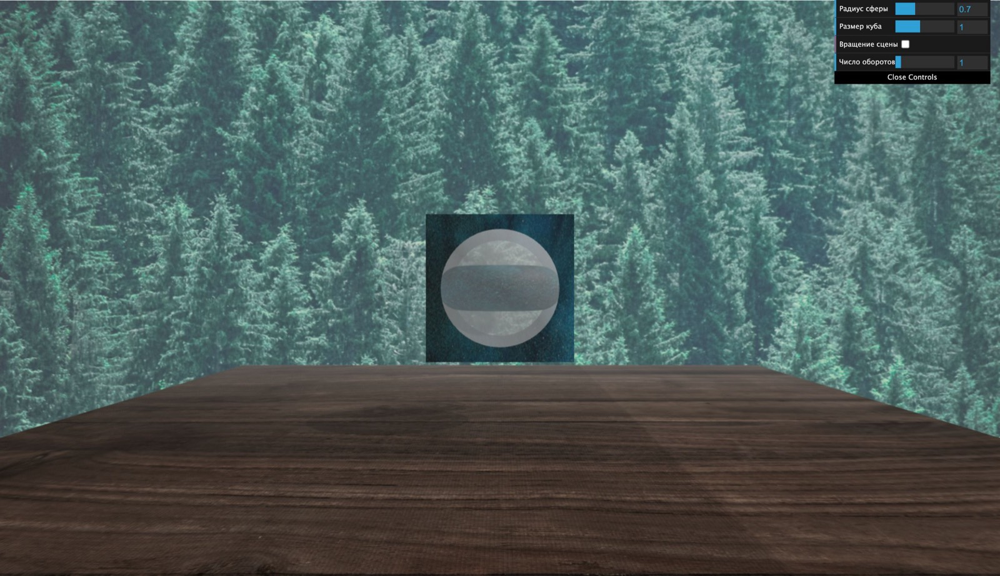
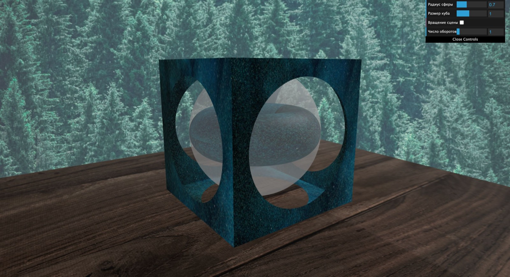

# Scene with the stencil buffer

Демонстрация работы **stencil-буфера** в three.js: в гранях вращающегося куба «вырезаны» круглые отверстия, через которые видно объекты внутри сцены. Визуальный трюк построен на трафарете (stencil), а не на прозрачности или вырезающей геометрии.

## Что показывает
- `THREE.WebGLRenderer({ stencil: true, antialias: true })` — рендерер с включённым stencil-буфером.
- Для каждой грани куба создаются два меша: круглое «отверстие» (`circleGeometry`) и сама грань (`PlaneGeometry`), с материалами на базе stencil:
  - отверстие: `stencilWrite: true`, `stencilFunc: THREE.NeverStencilFunc`, `stencilRef: sideN`, `stencilFail: THREE.ReplaceStencilOp`;
  - грань: `stencilWrite: true`, `stencilFunc: THREE.NotEqualStencilFunc`, `stencilRef: sideN`, `stencilZPass: THREE.ReplaceStencilOp`.
- Грани куба (`case 1..6`) позиционируются и поворачиваются под 90°, собираясь в куб (`src/modules/createCubeFace.js`).
- Внутри сцены: сфера, тор и куб; `OrbitControls` для навигации мышью; туман (`FogExp2`) и мягкие тени (`PCFSoftShadowMap`).
- Панель `dat.GUI` (`src/modules/addGui.js`): радиус сферы и тора, размер куба, вкл/выкл вращения, число оборотов в секунду.

## Стек
- three.js `^0.181.2`, dat.gui `^0.7.9`, Vite `^7.2.4`, Prettier.

## Структура
- `src/main.js` — инициализация сцены, камеры, рендерера, анимация.
- `src/modules/createCubeFace.js` — грань куба со stencil-отверстием.
- `src/modules/createObjects.js`, `createSurface.js`, `createSphereAndTorus.js`, `createCube.js`, `setLights.js`, `addGui.js`.
- `public/` — фоновые текстуры.

## Запуск
```sh
yarn install
yarn dev        # Vite dev-сервер
```
Сборка и предпросмотр:
```sh
yarn build
yarn preview
```

## Скриншоты

Сцена при загрузке: куб с круглым stencil-«отверстием», внутри видны объекты; панель `dat.GUI` — справа сверху.


Приближенный вид: эффект вырезанного отверстия в грани.

Дополнительно можно снять: режим «Вращение сцены», изменение радиуса сферы/тора и размера куба (контролы `dat.GUI`).

## Заметки
- В репозитории закоммичен `dist/` (результат сборки). Это не мешает запуску, но обычно сборку не хранят в репозитории.
- Отдельного `vite.config.*` нет — используются настройки Vite по умолчанию.
